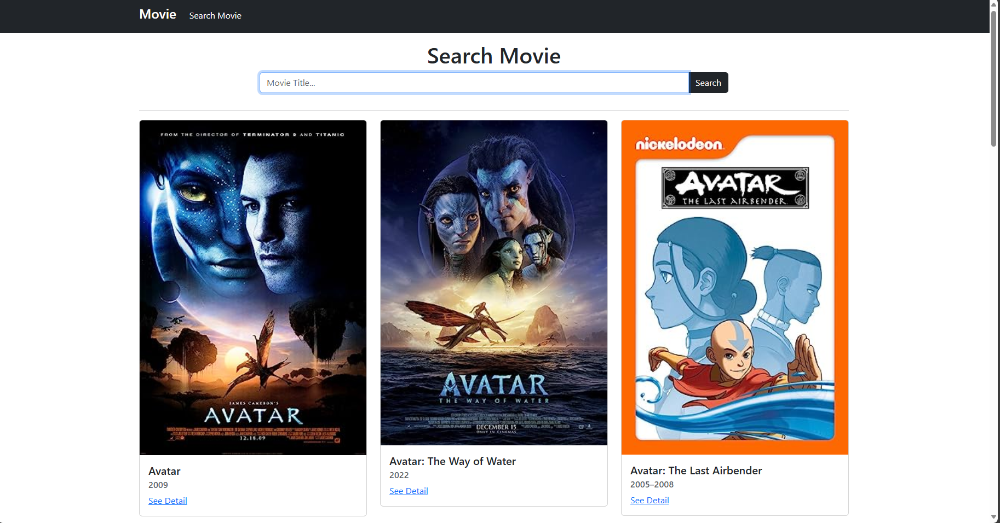
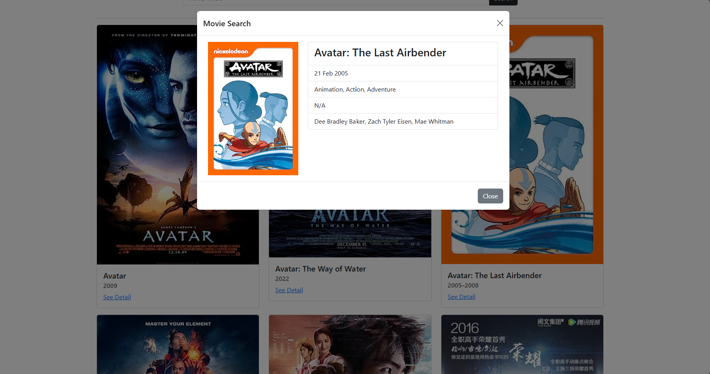

# List Movie
Sebuah halaman website untuk menampilkan film - film populer saat ini menggunakan api `The Movie Database API`

## Daftar Isi
- [Tumpukan Teknologi](#tumpukan-teknologi)
- [Fitur](#fitur)
- [Beberapa Dokumentasi Halaman](#beberapa-dokumentasi-halaman)
- [Cara Instalasi](#cara-instalasi)

## Tumpukan Teknologi
### Bahasa Pemograman
- **JavaScript**: Bahasa pemrograman yang digunakan untuk mengembangkan antarmuka pengguna yang dinamis dan interaktif

#### Library 
- **jQuery**: Library JavaScript yang cepat, kecil, dan kaya fitur untuk mempermudah manipulasi dokumen HTML, penanganan event, animasi, dan AJAX.

### API
Proyek ini menggunakan API untuk mendapatkan data dari `IMDB`

## Fitur
- Mencari film yang ingin dicari
- Menampilkan deayil film yang dicari

## Beberapa Dokumentasi Halaman
##### 1. Halaman Pencarian


##### 2. Halaman Detail Film


## Cara Instalasi

```bash
# Clone repository ini
git clone https://github.com/defrijay/def-movie.git

# Masuk ke direktori proyek
cd def-movie

# Instal extension live server di vscode

# Buka dengan live server agar tampilan dibuka secara live
```

## Cara Penggunaan
```bash
1. Cari film yang ingin dicari
2. Buka detail dari film yang dicari
```
